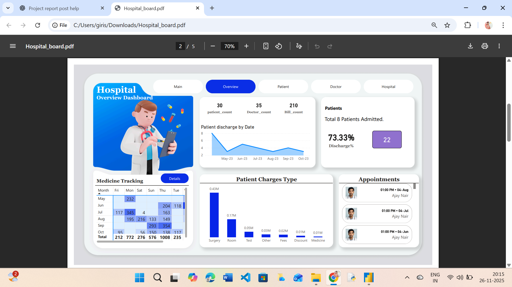
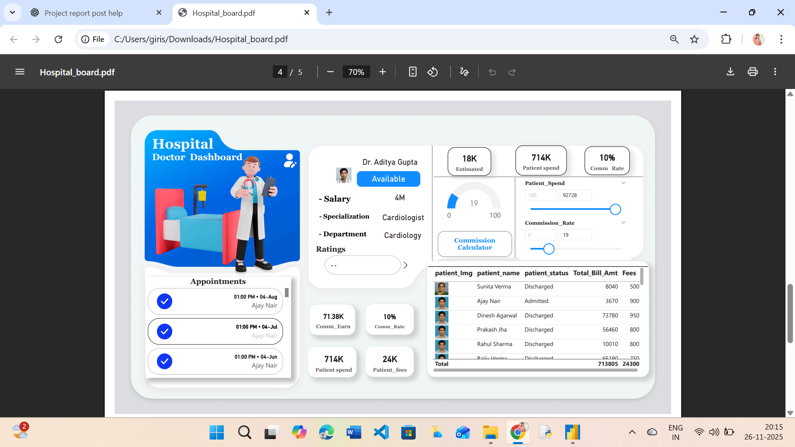

# Hospital Management Dashboard – Power BI

A complete data-driven solution to streamline hospital operations, monitor patient flow, track doctor performance, manage medicines, and assist administrators in making informed decisions — all built using **Power BI**.

---

## 📌 Project Overview

This project showcases a fully interactive **Hospital Management Dashboard** that integrates operational, financial, clinical, and inventory data into a unified analytics system.

Hospitals deal with multiple moving parts — patients, doctors, surgeries, billing, tests, rooms, medicines.  
This dashboard helps answer crucial questions like:

- How many patients were admitted/discharged today?
- Which doctor has the most appointments?
- Which medicines are running low?
- Are any clinical test results abnormal?
- What is the overall revenue trend?

The aim is to bring **clarity, efficiency, and actionable insights** for better decision-making.

---

## 🧩 Key Features

- Multi-page Power BI dashboard  
- Real-time KPIs for quick decisions  
- Patient admission/discharge analysis  
- Doctor availability, appointments & commission insights  
- Surgery & room occupancy tracking  
- Medicine inventory and top-selling drugs  
- Abnormal test results highlighted  
- Clean UI with slicers and interactive visuals  

---

## 📊 Dashboard Pages

### **1. Overview Dashboard**
- Patient Count, Doctor Count, Bill Count  
- Monthly trends for admissions, discharges & billing  
- Revenue breakdown and charge composition  
- Overall discharge insights  

### **2. Patient Dashboard**
- Admission vs Discharge  
- Patient details (age, diagnosis, room type)  
- Stay duration trends  
- Capacity and flow optimization  

### **3. Doctor Dashboard**
- Availability and appointment tracking  
- Speciality distribution  
- Performance overview  
- Commission Calculator (10% default)  

### **4. Hospital Operations**
- Surgery schedule monitoring  
- Room & bed occupancy  
- Clinical test results  
- Abnormal results clearly flagged  

### **5. Medicine Tracker**
- Total medicine quantity (121 units)  
- Top-selling medicines  
- Inventory status  
- Pharmacy revenue contribution  

---

## 📈 Key KPIs

| KPI | Value |
|------|--------|
| **Total Patients** | 30 |
| **Total Doctors** | 35 |
| **Total Bills** | 210 |
| **Discharge Rate** | ~73% |
| **Total Medicine Qty** | 121 |
| **Commission Rate** | 10% |
| **Total Patient Expenditure** | ~₹714,000 |

---

## 🛠 Tech Stack

- **Power BI Desktop**  
- DAX (Calculated Measures)  
- Power Query (ETL)  
- Data Modelling (Star Schema)  
- Excel / CSV Dataset  

---

---

## 🖼 Screenshots

### **Overview Dashboard**

### **Patient Dashboard**

### **Doctor Dashboard**

### **Hospital Operations**

### **Medicine Tracker**

---

## 🎥 Demo Video

[▶️ Watch Demo Video](assets/demo-video.mp4)

---

